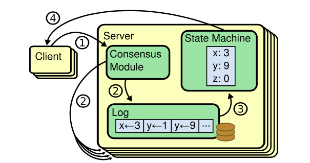
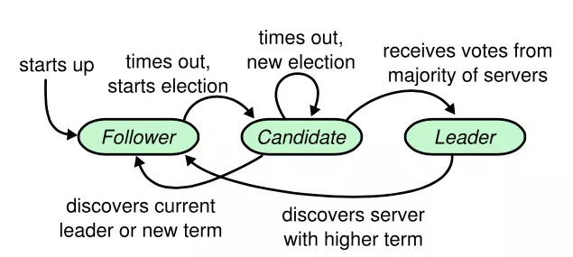
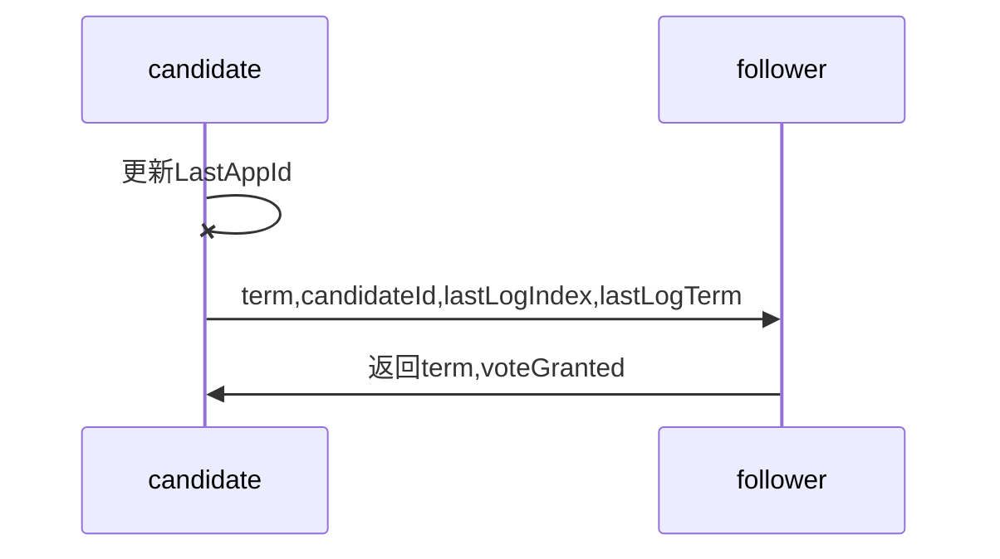
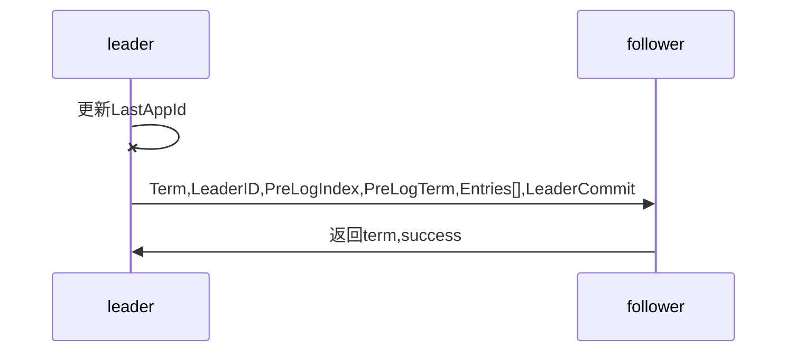
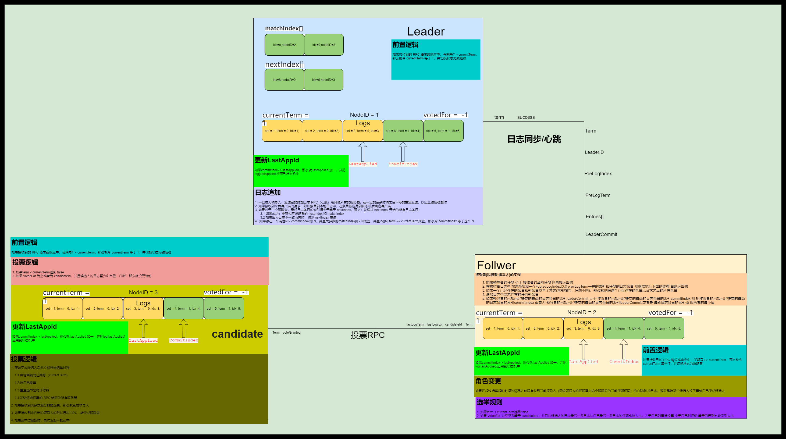
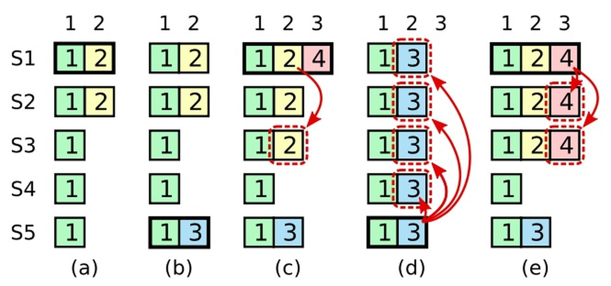

# Raft 学习

## Raft简介

### 分布式系统的一些问题

在分布式系统中如何多快好省的对大规模数据进行存储和计算呢？有两种方法。

1. 用更好的机器（更大的内存，更大的硬盘，和更好的CPU）
2. 用更多的机器

1的方法简单，但是存在硬件瓶颈，而且对成本也要求过高。

2方法，成本较1方法低一些，对于硬件瓶颈一般可以通过扩容解决。但是需要多台机器之前协调一致的工作，实现起来比较麻烦。

如何让跨网络的机器之间协调一致的工作？

1. 状态的立即一致
2. 状态的最终一致

在网络中的失败可以分为，延迟，或失败，我们无法判断到底是延迟还是失败，所以我们最求状态最终一致性

如何应对网络的不可靠以及节点的失效？

1. 可读写
2. 可读
3. 不可用

这里我们将组织机器使其状态最终一致并允许局部失败的算法称之为**一致性算法**

`Paxos`算法由来已久,目前是功能和性能最完善的一致性算法，然而他难以理解与实现。 `raft`简化了`paxos`,它是以易于理解为首要目标,尽量提供与`paxos`一样的功能与性能。

## 复制状态机

一致性算法的目标就是保证集群上所有节点的状态一致,节点要执行的指令可以分为两种,读与写。只有写指令会改变节点状态,**因此为了保证集群各个节点状态的一致,那就必须将写指令同步给所有节点。**

理想状态下,我们期望**任意节点**发生写命令都会**立即**的在其他节点上变更状态,这其中没有任何时延,所有节点都好像是单机一样被变更状态。

**网络延迟要远远慢于内存操作**, 写入命令不可能被同时执行,因此如果在不同节点发生不同的写命令,那么在其他节点上这些写命令被应用的顺序很可能完全不同。

如果我们不要求所有节点的写命令立即被执行,而仅仅是保证所有的写命令在所有的节点上按同样的顺序最终被执行呢?

 **第一, 仅仅允许一个节点处理写命令**

**第二,所有的节点维护一份顺序一致的日志。**

每个节点上的状态机按照自己的节奏,逐条应用日志上的写命令来变更状态

## 定义问题

根据上面的需求我们来定义一些问题

1. 输入: 写入命令
2. 输出: 所有节点最终处于相同的状态
3. 约束
   1. 网络不确定性: 在非拜占庭情况下,出现网络 分区/冗余/丢失/乱序 等问题下要保证正确。
   2. 基本可用性: 集群中大部分节点能够保持相互通信,那么集群就应该能够正确响应客户端
   3. 不依赖时序: 不依赖物理时钟或极端的消息延迟来保证一致性
   4. 快速响应: 对客户端请求的响应不能依赖集群中最慢的节点

根据上面问题我们写出一个可行解

1. 初始化的时候有一个领导者节点，负责发送日志到其他跟随者,并决定日志的顺序
2. 当读请求到来时,在任意节点都可以读,而写请求只能重定向到领导者进行
3. 领导者先写入自己的日志,然后同步给半数以上节点,跟随者表示都可以了,领导者才提交日志
4. 日志最终由领导者先按顺序应用于状态机,其他跟随者随机应用到状态机
5. 当领导者崩溃后,其他跟随者通过心跳感知并选举出新的领导者继续集群的正常运转
6. 当有新的节点加入或退出集群,需要将配置信息同步给整个集群

## raft具体实现

#### 状态机

1. 一开始所有节点为`follower`
2. 启动心跳计时器（等待`leader`心跳）
3. 计时器超市变为`candidate`
4. 发起投票，启动选举超时计时器
5. 等待投票，并投自己一票
6. 如果投票成功，自己变为`leader`并发出心跳和同步日志
7. 如果投票没有回应，再次跟新自己的状态，并重新发起投票。
8. 如果等来的是新`leader`的心跳则自己变为`follow`
9. 假如`leader`发现更大的`leader`（脑裂），则比较`term`的值。
10. 如果每个节点都是同时启动，同时发起选举，这无法产生`leader`，`raft`为了避免这种情况，则对于计时器超时设为随机值。

## raft数据结构

通用持久状态（持久化磁盘的，三个角色都有）

| 参数          | 解释                                                         |
| ------------- | ------------------------------------------------------------ |
| `currentTerm` | 服务器已知最新的任期（在服务器首次启动的时候初始化为0，单调递增） |
| `voteFor`     | 当前任期内收到选票的`candidateId`如果没有投给任何`candidate` 则为空 |
| `log[]`       | 日志条目;每个条目包含了用于状态机的命令，以及`leader`接收到该条目时的任期（第一个索引为1） |

通用易失性状态

| 参数          | 解释                                                         |
| ------------- | ------------------------------------------------------------ |
| `commitIndex` | 已知已提交的最高的日志条目的索引（初始值为0，单调递增）      |
| `lastApplied` | 已经被应用到状态机的最高的日志条目的索引（初始值为0，单调递增） |

`leader`的易失性状态

| 参数           | 解释                                                         |
| -------------- | ------------------------------------------------------------ |
| `nextIndex[]`  | 对于每一台服务器，发送到该服务器的下一个日志条目的索引（初始值为领导者最后的日志条目的索引+1） |
| `matchIndex[]` | 对于每一台服务器，已知的已经复制到该服务器的最高日志条目的索引（初始值为0，单调递增） |

## `RPC`

由`candidate`发起选的`RPC`：请求投票`RPC`

由`leader`发起的`RPC`：

1. 日志追加
2. 心跳通知

### 请求投票`RPC`

#### 时机：

1. `follower`变为`candidate`之后（很久没有收到leader的心跳之后）
2. 选举超时之后

#### 请求参数：

| 参数           | 解释                         |
| -------------- | ---------------------------- |
| `term`         | 候选人的任期号               |
| `candidateId`  | 请求选票的候选人的 Id        |
| `lastLogIndex` | 候选人的最后日志条目的索引值 |
| `lastLogTerm`  | 候选人最后日志条目的任期号   |

#### 返回值

| 返回值        | 解释                                       |
| ------------- | ------------------------------------------ |
| `term`        | 当前任期号，以便于候选人去更新自己的任期号 |
| `voteGranted` | 候选人赢得了此张选票时为真                 |

### 投票过程

##### `candidate`投票逻辑

1.在转变为`candidate`之后（刚启动，或者长时间没有收到`leader`的心跳），立即开始选举过程

​	1.1自增自己的任期号(`currentTerm`)

​	1.2给自己投票

​	1.3重置选举定时器

​	1.4发送请求投票的`RPC`给其他的所有服务器

2.如果接收到大多数服务器的选票，那么就变为领导人

3.如果收到来自新的领导人的附加日志`RPC`，转变成跟随者

4.如果选举过程超时，再次发起一次选举。

补充：如果candidate投票的时候，收到了来自新的leader的心跳（`term`大于`currentTerm`），那么让`currentTerm`等于`term`，并切换为`follwer`

在后台有个异步线程（或者协程）更新状态机状态，其逻辑为，如果`commitIndex`>`lastApplied`，那么久`lastApplied`加一，并把`log[lastApplied]`应用到状态机中。

总结：什么样的`candidate`才能成为`leader`?

只有拥有所有的已提交日志的`candidate`才能成为`leader`。

#### `follower`选举规则

1. 如果`term` <  `currentTerm`  返回`false`
2. 如果`voteFor`为空或者等于`candidateId`，并且跟`candidate`的最后一条日志与自己的最后一条日志的任期比较大小，大于自己则直接投票，小于自己则拒绝，等于自己时则比较索引的大小。

### 追加日志&心跳（`leader`调用）

调用时机：

1.客户端发起写命令请求时

2.发送心跳时

3.日志匹配失败时

#### 请求参数

| 参数           | 解释                                                         |
| -------------- | ------------------------------------------------------------ |
| `term`         | 当前领导者的任期                                             |
| `leaderId`     | 领导者ID 因此跟随者可以对客户端进行重定向                    |
| `prevLogIndex` | 紧邻新日志条目之前的那个日志条目的索引                       |
| `prevLogTerm`  | 紧邻新日志条目之前的那个日志条目的任期                       |
| `entries[]`    | 需要被保存的日志条目（被当做心跳使用是 则日志条目内容为空；为了提高效率可能一次性发送多个） |
| `leaderCommit` | 领导者的已知已提交的最高的日志条目的索引                     |

#### 返回值

| 返回值    | 解释                                                         |
| --------- | ------------------------------------------------------------ |
| `term`    | 当前任期,对于`leader`而言 它会更新自己的任期                 |
| `success` | 结果为真 如果跟随者所含有的条目和`prevLogIndex`以及`prevLogTerm`匹配上了 |

##### 追加日志&心跳过程

#### `leader`日志追加逻辑

1.一旦成为领导人：发送空的附加日志`RPC`给其他所有的服务器；在一定的空余时间之后不停的重复发送（用于防止follower心跳超时，从而阻止follower转变成candidate进行投票,还有一个作用就是告诉大部分节点自己的任期，防止[选举限制](###选举限制)）。

2.如果收到来自客户端的请求，附加条目到本地日志中，在条目被应用到状态机后响应客户端。

3.如果对于任意一个`follower`，`leader`的最后日志条目的索引值大于等于`nextIndex`,那么发送从`nextIndex`开始的所有日志条目到`follower`。

​	3.1.如果成功：更新相应的`follower`的`nextIndex`和`matchIndex`

​	3.2.如果因为日志不一致而失败，减少`nextIndex`重试

4.如果存在一个满足 `N > commitIndex`的`N`，并且大多数的`matchIndex[i] >= N`成立，并且`log[N].term == currentTerm`成立，那么令 `commitIndex`等于这个`N`

#### `follower`日志追加逻辑

1.如果`leader`的任期，小于接受者当前的任期则直接返回假。

2.在接受者的日志中，如果能找到一个`prevLogIndex`以及`prevLogTerm`一样的索引和任期的日志条目，则继续执行下面的步骤，否则返回假。

3.如果一个已经存在的条目和新条目发生了冲突，（索引相同，任期不同），那么就删除这个已经存在的条目以及他之后的所有条目

4.追加日志中尚未存在的最新条目

5.如果领导者已知已经提交的最高的日志条目的索引`leaderCommit`大于接收者的已知已经提交的最高的日志条目的索引`commitIndex`则把接收者的已知已经提交的最高的日志条目的索引`commitIndex`重置为，领导者已知已经提交的最高的日志条目索引的`leaderCommit`或是最新日志条目的索引值取两者之间的最小值。

#### `RPC`调用过程总结：

如图

## 算法的原理与证明

### 五条公理

| 特性             | 解释                                                         |
| ---------------- | ------------------------------------------------------------ |
| 选举安全特性     | 对于一个给定的任期号，最多只会有一个领导人被选举出来         |
| 领导人只附加原则 | 领导人绝对不会删除或者覆盖自己的日志，只会增加               |
| 日志匹配原则     | 如果两个日志在相同的索引位置的日志条目的任期号相同，那么我们就认为这个日志从头到这个索引位置之间全部完全相同 |
| 领导人完全特性   | 如果某个日志条目在某个任期号中已经被提交，那么这个条目必然出现在更大任期号的所有领导人中 |
| 状态机安全特性   | 如果一个领导人已经将给定的索引值位置的日志条目应用到状态机中，那么其他任何的服务器在这个索引位置不会应用一个不同的日志 |

###  选举限制

**选民只会投票给任期比自己大，最后一条日志比自己新( 任期大于 或者 等于时索引更大)的候选人。**

但这真的正确吗？

如下图所示：

1. 时刻`a`，`Sl`是任期2的领导人并且向部分节点（`S1`和`S2`）复制了2号位置的日志条目，然后宕机
2. 时刻`b`，`S5`获得了`S3`、`S4`(` S5`的日志与`S3`和`S4`的一样新，最新的日志的任期号都是1）和自己的选票赢得了选举，成了3号任期的领导人，并且在2号位置上写人了一条任期号为3的日志条目。在新日志条目复制到其他节点之前，`S5`若机了
3. 时刻c，`S1`重启，并且通过`S2`、`S3`、`S4`和自己的选票赢得了选举，成了4号任期的领导人，并且继续向`S3`复制2号位置的日志。此时，任期2的日志条目已经在大多数节点上完成了复制
4. 时刻d，`S1`发生故障，`S5`通过`S2`、`S3`、”的选票再次成为领导人（因为`S5`最后一条日志条目的任期号是3，比`S2`、`S3`、`S4`中任意一个节点上的日志都更加新），任期号为5。然后`S5`用自己的本地日志夜写了其他节点上的日志
5. 上面这个例子生动地说明了，即使日志条目被半数以上的节点写盘（复制）了，也并不代表它已经被提交（`commited`）到Raft集群了——因为一旦某条日志被提交，那么它将永远没法被删除或修改。这个例子同时也说明了，领导人无法单纯地依靠之前任期的日志条目信息判断它的提交状态
6. 因此，针对以上场景，`Raft`算法对日志提交条件增加了一个额外的限制：要求Leader在当前任期至少有一条日志被提交，即被超过半数的节点写盘
7. 正如上图中e描述的那样，`Sl`作为`Leader`，在崩溃之前，将`3`号位置的日志（任期号为`4`）在大多数节点上复制了一条日志条目（指的是条目3，`term` 4），那么即使这时`Sl`若机了，SS也不可能赢得选举一一因为`S2`和白的最新日志条目的任期号为4，比`SS`的3要大，`S3`无法获得超过半数的选票。“无法赢得选举，这就意味着2号位置的日志条目不会被覆写 

**所以新上任的领导者在接受客户端写入命令之前 需要提交一个no-op(空命令)，**携带自己任期号的日志复制到大多数集群节点上才能真正的保证选举限制的成立。

## 引用 

[Raft论文中文版](https://www.infoq.cn/article/raft-paper/)

[Raft 分布式一致性(共识)算法 论文精读与ETCD源码分析 视频](https://www.bilibili.com/video/BV1CK4y127Lj?t=14&p=3)

[视频相关文档](https://hardcore.feishu.cn/docs/doccnMRVFcMWn1zsEYBrbsDf8De#)

[Etcd  raft库实现](https://www.codedump.info/post/20180922-etcd-raft/)

[raft 算法动画讲解](http://thesecretlivesofdata.com/raft/#election)

[Etcd  raft库实现](https://www.codedump.info/post/20180922-etcd-raft/)

[图解raft](https://zhuanlan.51cto.com/art/201910/604122.htm)

